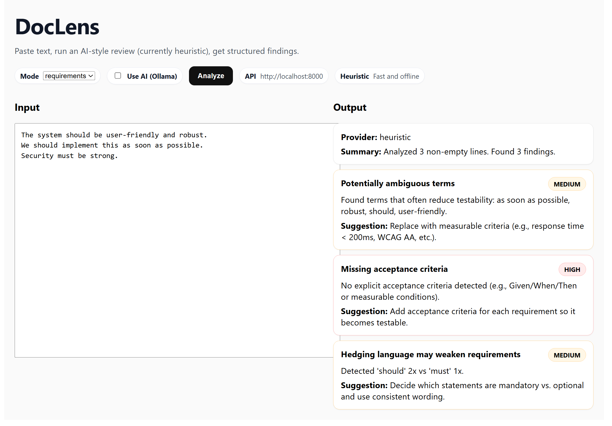

# DocLens


[](https://github.com/CarlJosef/dockLens/actions/workflows/ci.yml)
[](https://github.com/CarlJosef/dockLens/actions/workflows/ai-smoke.yml)

---

## What is DockLens?

**DocLens** is a lightweight text analyzer for requirements and specs.
It helps teams turn vague, “sounds good” statements into **clearer, more testable, structured findings**.

Paste text in the UI, run an analysis, and get:

- A **summary** of what was analyzed
- A list of **findings** with **severity** (low/medium/high)
- Actionable **suggestions** (e.g., define acceptance criteria, replace ambiguous terms)

DocLens supports two execution modes:

- **Heuristic (default):** fast, offline, great for demos and everyday use
- **Local AI via Ollama (optional):** deeper language understanding with clear tradeoffs (latency/CPU)

### Typical findings

DocLens looks for patterns that reduce testability and clarity, such as:

- **Ambiguous terms** (“robust”, “user-friendly”, “as soon as possible”)
- **Hedging language** (“should” vs “must”)
- **Missing acceptance criteria** (no measurable or Given/When/Then conditions)

- Clear UI state while analysis runs (no “frozen” feeling)
- Consistent card-based layout for readability
- Transparent provider reporting (`heuristic` vs `llm:ollama`)
- Simple Docker-based setup for quick onboarding

---

## Screenshot



## Run

### Start (default)

```powershell
docker compose up --build
```

**Stop**

    - docker compose down --volumes
    - Note: docker compose down --down is not a valid flag. Use down (optionally with --volumes) as above.

**Optional: Local AI (Ollama)**

    - Optional: Local AI (Ollama)
    - docker compose -f docker-compose.yml -f docker-compose.llm.yml up --build

    - Notes: LLM can take longer on CPU (typically 1–3 minutes, depending on CPU capacity).If timeouts occur,
             increase OLLAMA_TIMEOUT_S.

---

## API

**Health**

```bash
curl http://localhost:8000/healthz
```

---

**Analyze**
curl -X POST http://localhost:8000/v1/analyze `-H "Content-Type: application/json"`
-d '{ "mode": "requirements", "text": "Example text" }'

---

## Frontend

Open the UI (Docker Compose):

- http://localhost:5174/

## CI

[](https://github.com/CarlJosef/dockLens/actions/workflows/ci.yml)
[](https://github.com/CarlJosef/dockLens/actions/workflows/ai-smoke.yml)

## License

MIT — see [LICENSE](LICENSE).
